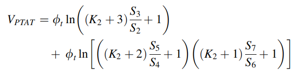
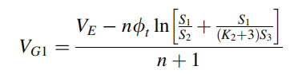
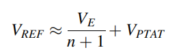

# Table of Contents
1. [TT_Simulations](#example)
2. [FF_Simulations](#example2)
3. [SS_Simulations](#third-example)
4. [Mismatch_simulations](#fourth-examplehttpwwwfourthexamplecom)

## Schematic

## Design Equations

 

## Temperature Simulation
*Band Gap Reference Temperature Simulation*

## Supply Variation Simulation

*Band Gap Reference Temperature Simulation*

