# Table of Contents
1. [Schematic](#Schematic)
2. [Design Equations](#DesignEquations)
3. [TT_Simulations](#TT_Simulations)
4. [FF_Simulations](#FF_Simulations)
5. [SS_Simulations](#SS_Simulations)
6. [SF_Simulations](#SF_Simulations)
7. [FS_Simulations](#FS_Simulations)
8. [Mismatch_simulations](#Mismatch_Simulations)

# Schematic
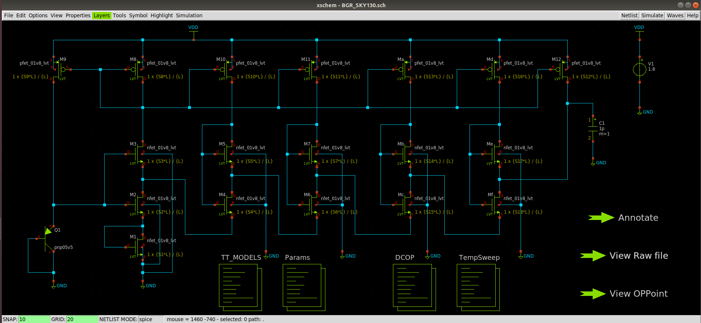

# Design Equations
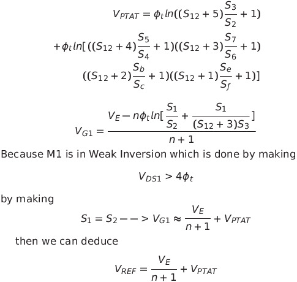

# TT_Simulations
## Temperature Simulation

## Supply Variation Simulation
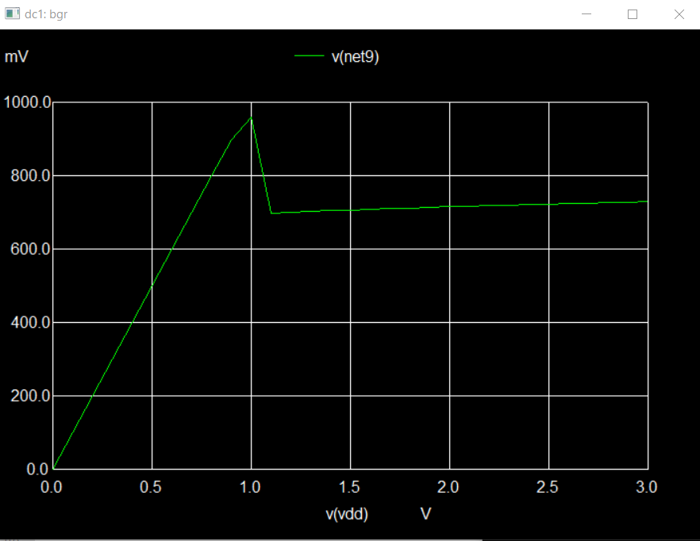

# FF_Simulations
## Temperature Simulation
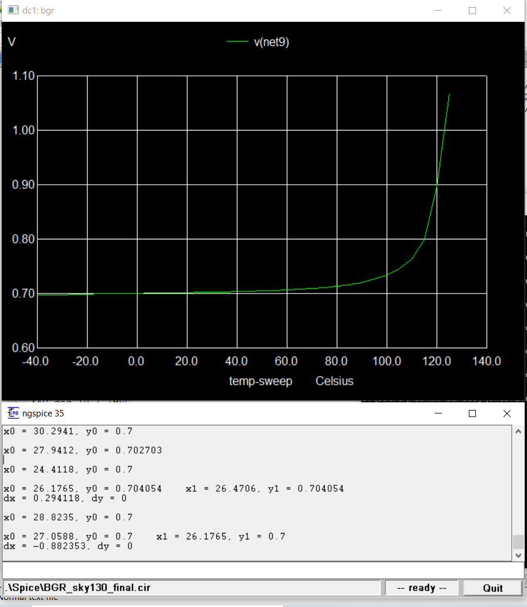

## Supply Variation Simulation
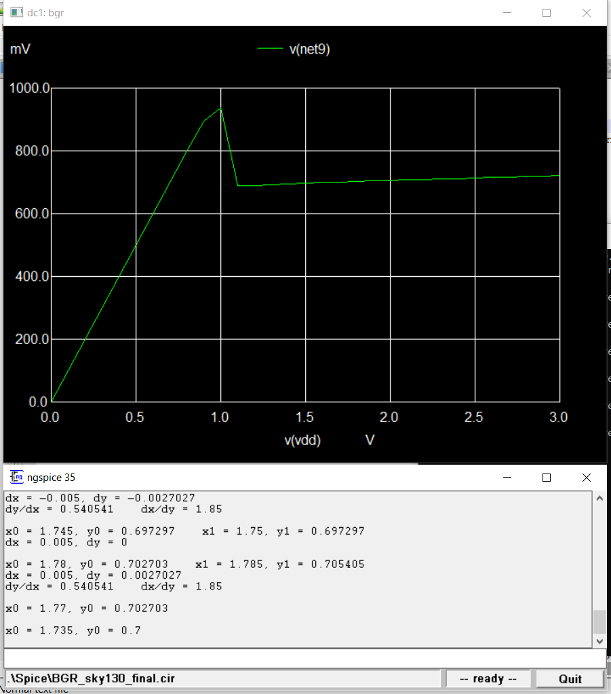

# SS_Simulations
## Temperature Simulation
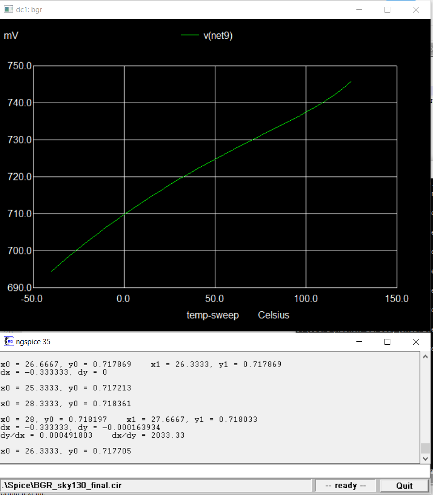

## Supply Variation Simulation
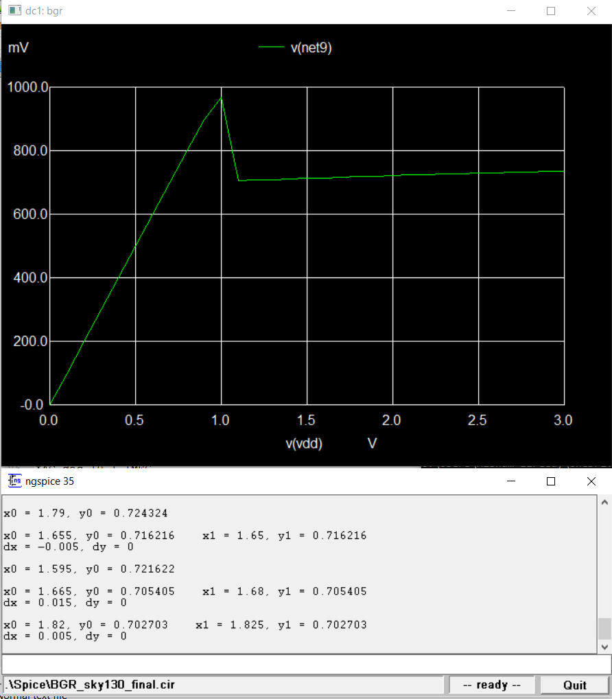

# SF_Simulations
## Temperature Simulation
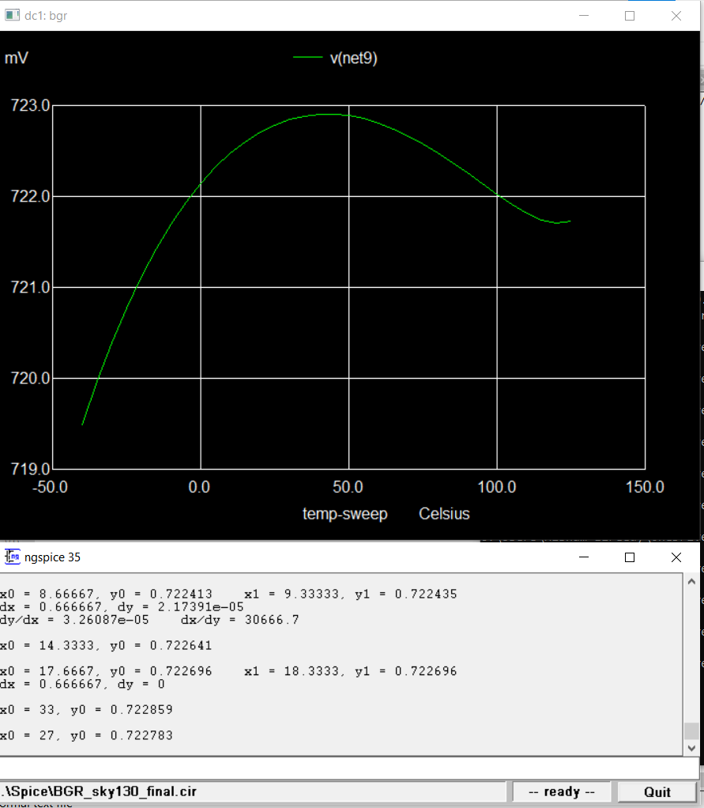

## Supply Variation Simulation
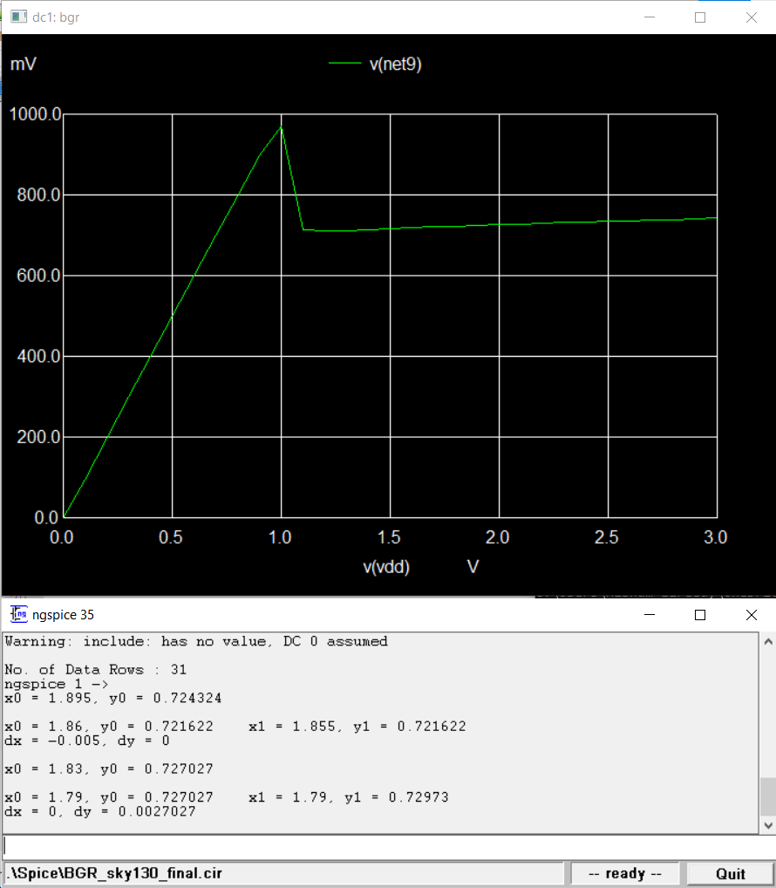

# FS_Simulations
## Temperature Simulation
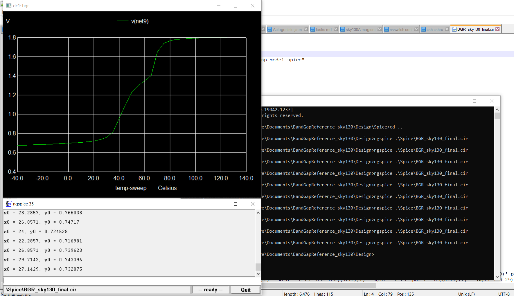

## Supply Variation Simulation
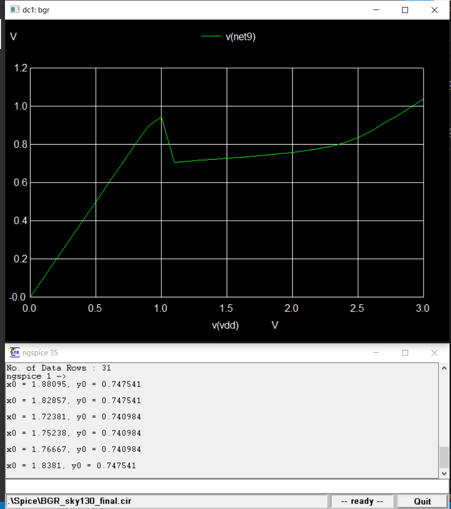

# Mismatch_Simulations
## Temperature Simulation

## Supply Variation Simulation
