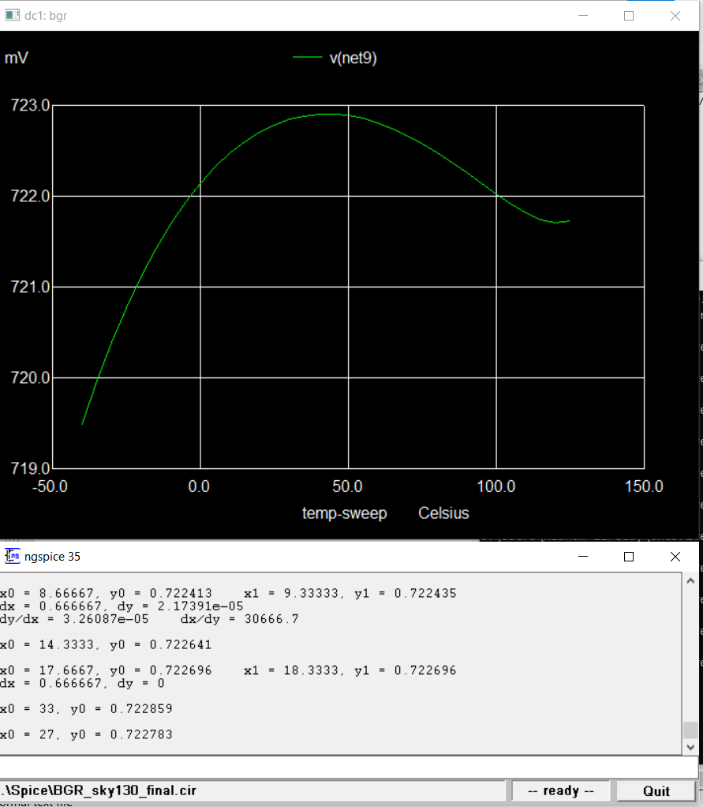
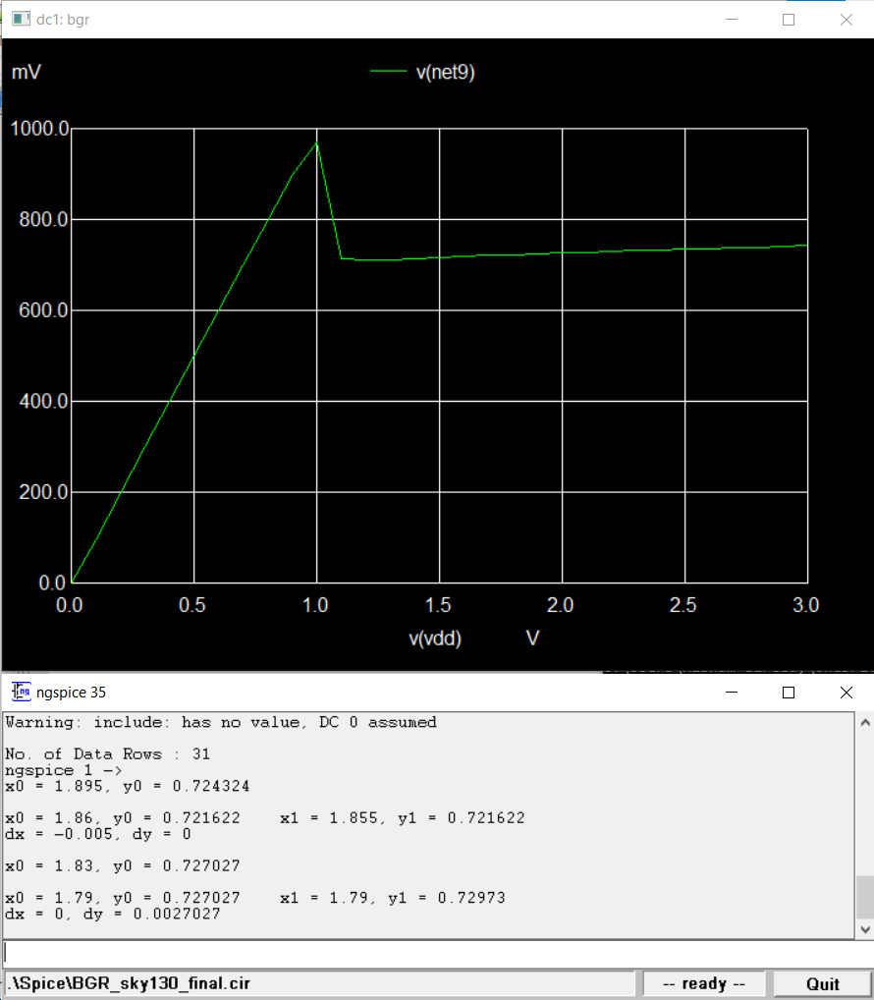
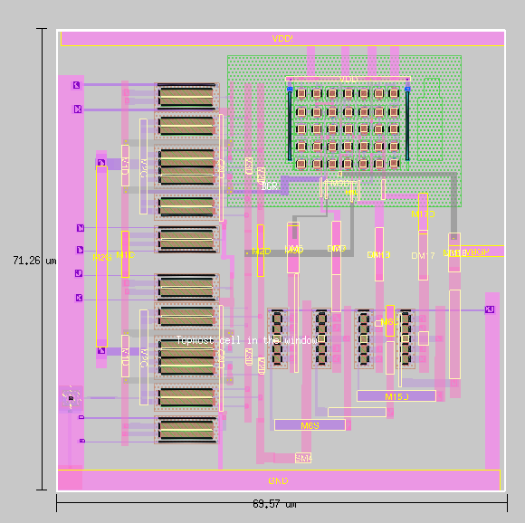

# BandGapReference_sky130
Design of BandGapReference Circuit using Sky130 PDK

# Table of Contents
1. [Block Diagram](#Block-Diagram)
2. [Design Specifications](#Design-Specifications)
3. [Figure of Merit](#Figure-of-Merit)
4. [Schematic](#Schematic)
5. [Design Equations](#Design-Equations)
6. [pre-layout Simulation](#pre-layout-simulation)
7. [layout Design](#layout-design)
8. [post-layout Simulation](#post-layout-simulation)
# Block-Diagram
*Band Gap Reference block diagram*

# Design-Specifications
*Band Gap Reference Design Specifications*

# Figure-of-Merit

*Band Gap Reference Figure of Merit*
# Schematic

# Design-Equations

# pre-layout-simulation
# TT_Simulations
## Temperature Simulation

## Supply Variation Simulation

# FF_Simulations
## Temperature Simulation

## Supply Variation Simulation

# SS_Simulations
## Temperature Simulation

## Supply Variation Simulation

# SF_Simulations
## Temperature Simulation

## Supply Variation Simulation

# FS_Simulations
## Temperature Simulation

## Supply Variation Simulation

# Layout-Design
# Full Layout

# Current Mirrors

 

# PTAT

# CTAT

# Post-Layout-Simulation
# TT_Simulation
## Temperature Simulation

## Supply variation Simulation

# SS_Simulations
## Temperature Simulation

## Supply Variation Simulation

# FF_Simulations
## Temperature Simulation

## Supply Variation Simulation

# SF_Simulations
## Temperature Simulation

## Supply Variation Simulation

# FS_Simulations
## Temperature Simulation

## Supply Variation Simulation
