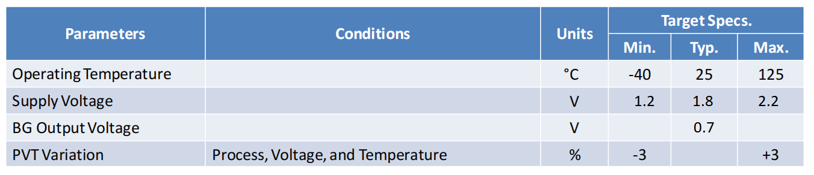
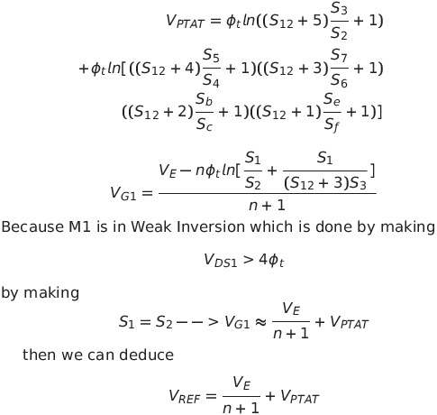
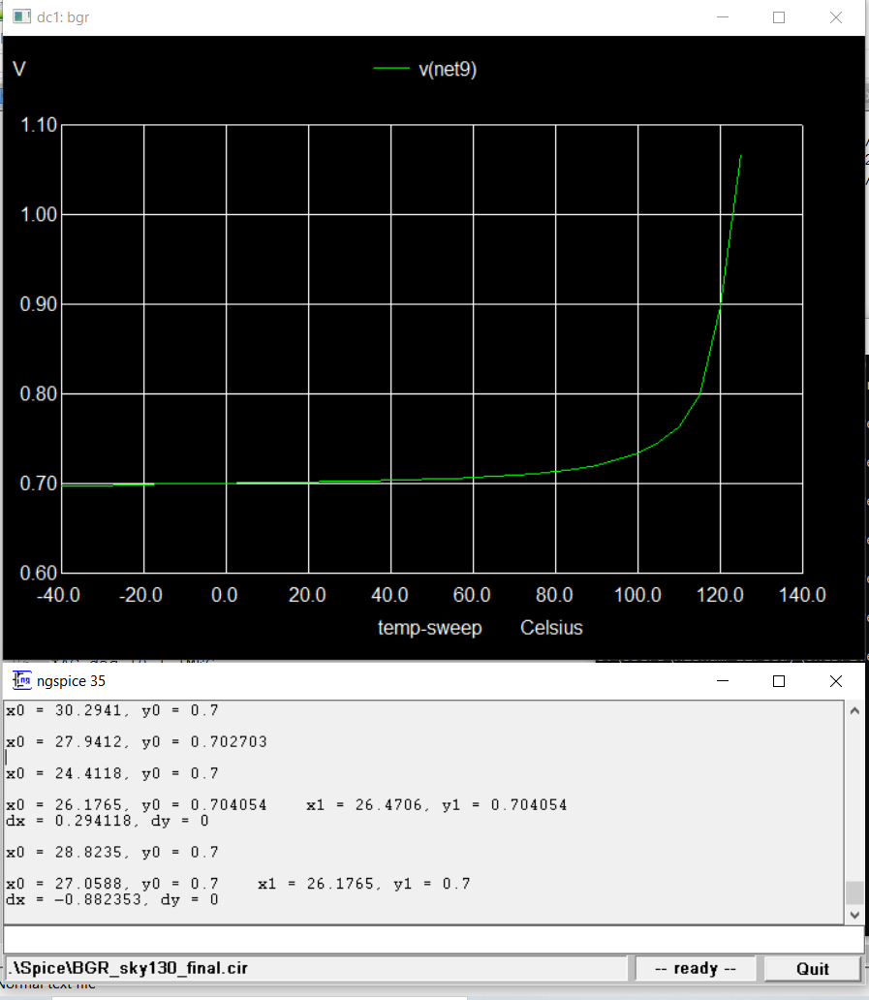
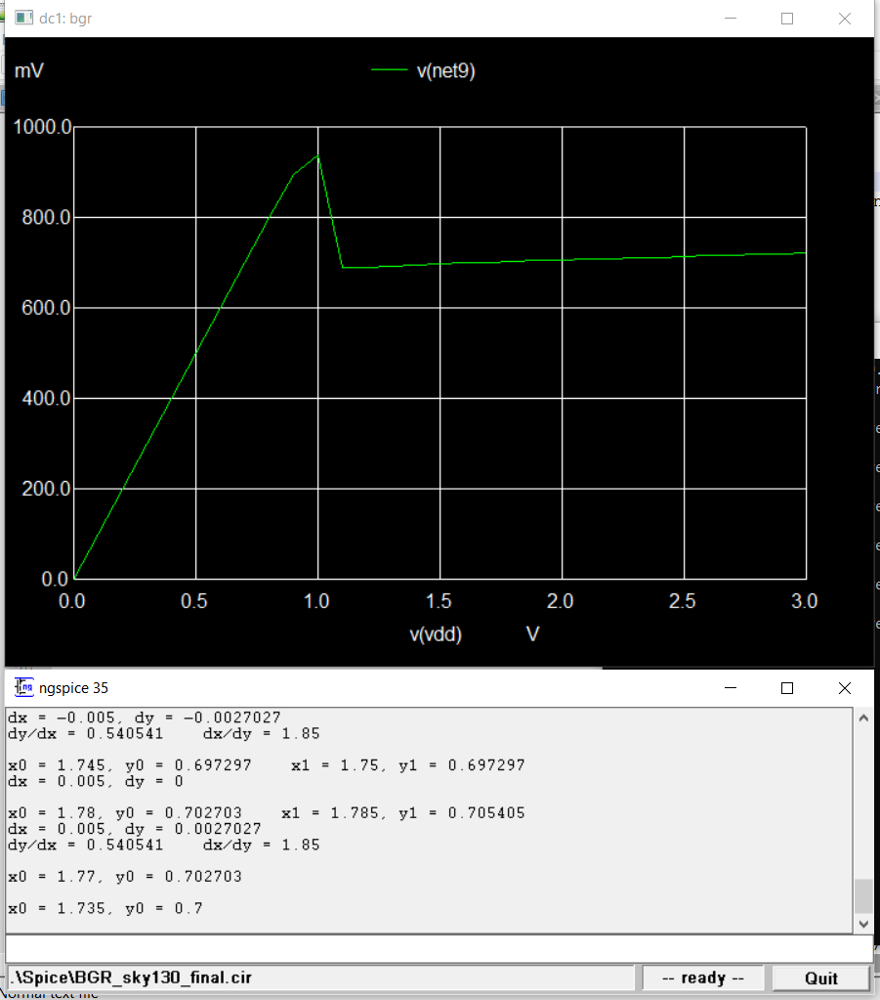

# BandGapReference_sky130
Design of BandGapReference Circuit using Sky130 PDK

# Table of Contents
1. [Block Diagram](#BlockDiagram)
2. [Design Specifications](#DesignSpecifications)
3. [Figure of Merit](#FigureofMerit)
4. [pre-layout Simulation](#pre-layout-simulation)
5. [layout Design](#layout-design)
# Block Diagram
*Band Gap Reference block diagram*

# Design Specifications
*Band Gap Reference Design Specifications*

# Figure of Merit

*Band Gap Reference Figure of Merit*

# pre-layout-simulation
# Table of Contents
1. [Schematic](#Schematic)
2. [Design Equations](#DesignEquations)
3. [TT_Simulations](#TT_Simulations)
4. [FF_Simulations](#FF_Simulations)
5. [SS_Simulations](#SS_Simulations)
6. [SF_Simulations](#SF_Simulations)
7. [FS_Simulations](#FS_Simulations)

# Schematic

# Design Equations

# TT_Simulations
## Temperature Simulation

## Supply Variation Simulation

# FF_Simulations
## Temperature Simulation

## Supply Variation Simulation

# SS_Simulations
## Temperature Simulation

## Supply Variation Simulation

# SF_Simulations
## Temperature Simulation

## Supply Variation Simulation

# FS_Simulations
## Temperature Simulation

## Supply Variation Simulation

# Layout-Design
# Full Layout

# Current Mirrors

 

# PTAT

# CTAT
